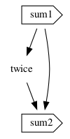
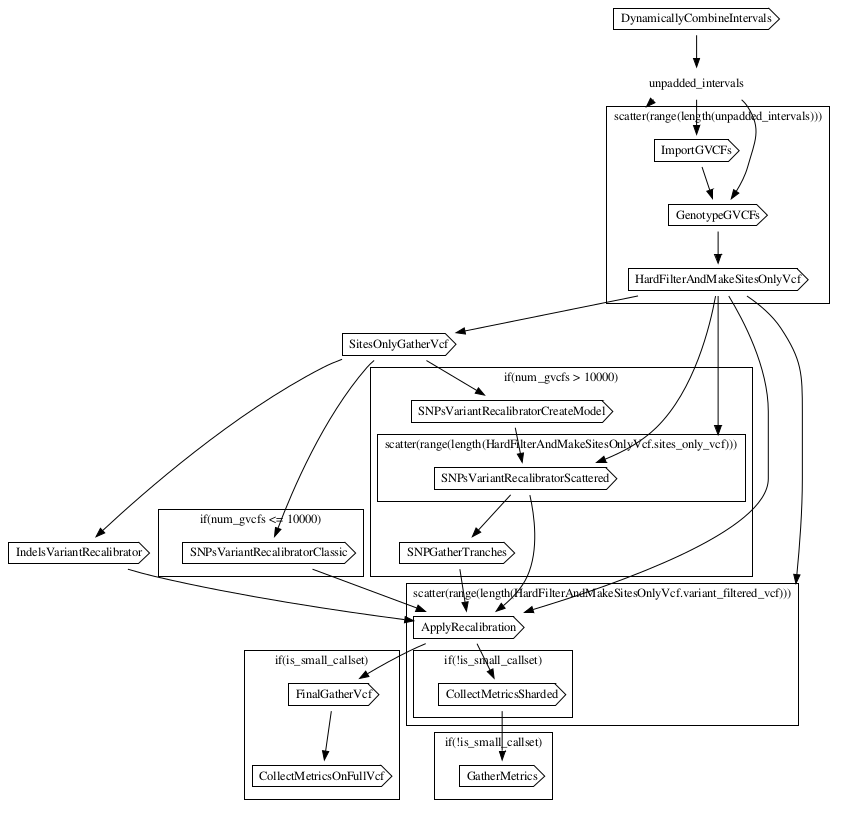

# wdlviz

In this lab, we'll develop a Python program using miniwdl's API to generate a [graphviz](https://www.graphviz.org/) visualization of a WDL workflow's internal dependency structure. We'll keep this example brief and barebones, while a more-elaborate version can be found [in the miniwdl repo](https://github.com/chanzuckerberg/miniwdl/blob/main/examples/wdlviz.py).

Begin by installing (i) graphviz using your OS package manager (e.g. `apt install graphviz`), and (ii) either `pip3 install miniwdl graphviz` or `conda install miniwdl graphviz` as you prefer.


## Loading the WDL document

Start a new Python3 script `wdlviz.py`:

```python3
#!/usr/bin/env python3
import os
import sys
import WDL
import graphviz


def main(args):
    # load WDL document given local filename
    doc = WDL.load(args[0] if args else "/dev/stdin")
    assert doc.workflow, "No workflow in WDL document"

    # visualize workflow
    wdlviz(doc.workflow).render("workflow.dot", view=True)
```

This prologue loads the WDL document, which we expect to contain a workflow, from either a given filename or standard input. Then we call our to-be-shown `wdlviz()` function to generate the [graphviz Python package's](https://pypi.org/project/graphviz/) representation of the workflow, which we render as a PDF in the current directory, and launch the host's PDF viewer.

## Simple workflow warm-up

Consider a workflow as a graph, whose nodes are task calls or intermediate value declarations, and edges represent dependencies of the WDL expressions found in the node, when they refer to a previous call output or intermediate value.

Miniwdl provides just such a representation in its WDL object model, where [`Workflow.body`](https://miniwdl.readthedocs.io/en/latest/WDL.html#WDL.Tree.Workflow.body) is a list of objects deriving from [`WorkflowNode`](https://miniwdl.readthedocs.io/en/latest/WDL.html#WDL.Tree.WorkflowNode), whose implementations include `Call`, `Decl`, and `Scatter` and `Conditional` sections. Each `WorkflowNode` exposes a `workflow_node_id` string, and a set `workflow_node_dependencies` of node IDs which it depends on. Miniwdl pre-computes these with detailed static analysis; for example, it finds `Call` dependencies by scanning each WDL expression in the [`Call.inputs`](https://miniwdl.readthedocs.io/en/latest/WDL.html#WDL.Tree.Call.inputs) and resolving identifiers to previous call outputs or value declarations. This detailed syntax tree is also exposed in the API (see previous codelab), but the `WorkflowNode` abstraction is most convenient for the application at hand.

Let's first consider simple workflows without scatter and conditional sections, only calls and value declarations. And to keep the visualization tidy, we'll exclude value declarations with no dependencies of their own.

```python3
def wdlviz(workflow):
    dot = graphviz.Digraph(comment=workflow.name)
    node_ids = set()

    for elt in workflow.body:
        shape = None
        if isinstance(elt, WDL.Call):
            shape = "cds"
        elif isinstance(elt, WDL.Decl) and elt.workflow_node_dependencies:
            shape = "plaintext"

        if shape:
            dot.node(elt.workflow_node_id, elt.name, shape=shape)
            node_ids.add(elt.workflow_node_id)
```

After initializing graphviz, we make a first pass through the workflow body to add the nodes for calls and intermediate value declarations. Continuing,

```python3
    for elt in workflow.body:
        for dep_id in elt.workflow_node_dependencies:
            if elt.workflow_node_id in node_ids and dep_id in node_ids:
                dot.edge(dep_id, elt.workflow_node_id)
    
    return dot

if __name__ == "__main__":
    main(sys.argv[1:])
```

We make a second pass to add the dependency edges (if both source and sink are among the nodes we included). Lastly, the standard footer to invoke our `main()` function.

Putting these together, we can run a simple example:


```bash
python3 wdlviz.py << 'EOF'
    version 1.0
    workflow w {
        call sum as sum1 {
            input: x = 1, y = 2
        }
        Int twice = 2*sum1.z
        call sum as sum2 {
            input: x = sum1.z, y = twice
        }
    }
    task sum {
        input {
            Int x
            Int y
        }
        command {
            echo $(( ~{x} + ~{y} ))
        }
        output {
            Int z = read_int(stdout())
        }
    }
EOF
```

Generating:



## Scatter & if sections

WDL `scatter` and `if` (conditional) sections can form a recursive structure, in which each such section has its own body, elements of which might be nested sub-sections. This demands a more-advanced version of `wdlviz()` to process this tree recursively.

```python3
def wdlviz(workflow):
    top = graphviz.Digraph(comment=workflow.name)
    top.attr(compound="true")
    node_ids = set()

    def add_node(dot, elt):
        nonlocal node_ids
        shape = None
        if isinstance(elt, WDL.WorkflowSection):
            with dot.subgraph(name="cluster-" + elt.workflow_node_id) as subdot:
                label = "scatter" if isinstance(elt, WDL.Scatter) else "if"
                subdot.attr(label=label + f"({str(elt.expr)})", rank="same")
                for child in elt.body:
                    add_node(subdot, child)
                subdot.node(
                    elt.workflow_node_id, "", style="invis", height="0", width="0", margin="0"
                )
            node_ids.add(elt.workflow_node_id)
            node_ids |= set(g.workflow_node_id for g in elt.gathers.values())
        elif isinstance(elt, WDL.Call):
            shape = "cds"
        elif isinstance(elt, WDL.Decl) and node_ids.intersection(elt.workflow_node_dependencies):
            shape = "plaintext"

        if shape:
            dot.node(elt.workflow_node_id, elt.name, shape=shape)
            node_ids.add(elt.workflow_node_id)

    for elt in workflow.body:
        add_node(top, elt)
```

When we encounter a [`WorkflowSection`](https://miniwdl.readthedocs.io/en/latest/WDL.html#WDL.Tree.WorkflowSection) (the base class of `Scatter` and `Conditional`), we create a corresponding [graphviz cluster](https://graphviz.gitlab.io/_pages/Gallery/directed/cluster.html) labelled with the section's scatter/condition expression, then recurse on each node in the section body. We add an invisible node to act as a sink for dependencies of the scatter/condition expression itself.

Workflow sections also complicate miniwdl's representation of the dependency structure, because a dependency between nodes not in the same section have a different meaning. (For example, a dependency on an `Int` node inside a `scatter` section implies an `Array[Int]` outside of that section.) To model this, miniwdl synthesizes [`Gather` nodes](https://miniwdl.readthedocs.io/en/latest/WDL.html#WDL.Tree.Gather) which intermediate dependencies between nodes inside a section and those outside. We won't include `Gather` nodes in the visualization, since they're an implicit concept, but we record them in `node_ids` and we'll use their API to resolve the internal node or "referee."

```python3
    def add_edges(elt):
        for dep_id in elt.workflow_node_dependencies:
            dep = workflow.get_node(dep_id)
            if isinstance(dep, WDL.Tree.Gather):
                dep = dep.final_referee
                dep_id = dep.workflow_node_id
            if elt.workflow_node_id in node_ids and dep_id in node_ids:
                lhead = None
                if isinstance(elt, WDL.WorkflowSection):
                    lhead = "cluster-" + elt.workflow_node_id
                top.edge(dep_id, elt.workflow_node_id, lhead=lhead)
        if isinstance(elt, WDL.WorkflowSection):
            for child in elt.body:
                add_edges(child)

    for elt in workflow.body:
        add_edges(elt)

    return top


if __name__ == "__main__":
    main(sys.argv[1:])
```

As a final detail, we use the `lhead` attribute to draw dependencies of the scatter/condition expressions leading into the whole cluster instead of the invisible internal node.

## Complete example

`wdlviz.py`:

```python3
#!/usr/bin/env python3
import os
import sys
import WDL
import graphviz


def main(args):
    # load WDL document given local filename
    doc = WDL.load(args[0] if args else "/dev/stdin")
    assert doc.workflow, "No workflow in WDL document"

    # visualize workflow
    wdlviz(doc.workflow).render("workflow.dot", view=True)


def wdlviz(workflow):
    top = graphviz.Digraph(comment=workflow.name)
    top.attr(compound="true")
    node_ids = set()

    def add_node(dot, elt):
        nonlocal node_ids
        shape = None
        if isinstance(elt, WDL.WorkflowSection):
            with dot.subgraph(name="cluster-" + elt.workflow_node_id) as subdot:
                label = "scatter" if isinstance(elt, WDL.Scatter) else "if"
                subdot.attr(label=label + f"({str(elt.expr)})", rank="same")
                for child in elt.body:
                    add_node(subdot, child)
                subdot.node(
                    elt.workflow_node_id, "", style="invis", height="0", width="0", margin="0"
                )
            node_ids.add(elt.workflow_node_id)
            node_ids |= set(g.workflow_node_id for g in elt.gathers.values())
        elif isinstance(elt, WDL.Call):
            shape = "cds"
        elif isinstance(elt, WDL.Decl) and node_ids.intersection(elt.workflow_node_dependencies):
            shape = "plaintext"

        if shape:
            dot.node(elt.workflow_node_id, elt.name, shape=shape)
            node_ids.add(elt.workflow_node_id)

    for elt in workflow.body:
        add_node(top, elt)

    def add_edges(elt):
        for dep_id in elt.workflow_node_dependencies:
            dep = workflow.get_node(dep_id)
            if isinstance(dep, WDL.Tree.Gather):
                dep = dep.final_referee
                dep_id = dep.workflow_node_id
            if elt.workflow_node_id in node_ids and dep_id in node_ids:
                lhead = None
                if isinstance(elt, WDL.WorkflowSection):
                    lhead = "cluster-" + elt.workflow_node_id
                top.edge(dep_id, elt.workflow_node_id, lhead=lhead)
        if isinstance(elt, WDL.WorkflowSection):
            for child in elt.body:
                add_edges(child)

    for elt in workflow.body:
        add_edges(elt)

    return top


if __name__ == "__main__":
    main(sys.argv[1:])
```

We can use this on any local WDL file with a workflow, e.g.

```bash
$ wget https://raw.githubusercontent.com/gatk-workflows/gatk4-germline-snps-indels/master/joint-discovery-gatk4-local.wdl
$ python3 wdlviz.py joint-discovery-gatk4-local.wdl
```

which generates this interesting graphic:



A more-elaborate version of this barebones example can be found [in the miniwdl repo](https://github.com/chanzuckerberg/miniwdl/blob/main/examples/wdlviz.py). Pull requests with feature and visual improvements are welcome!
